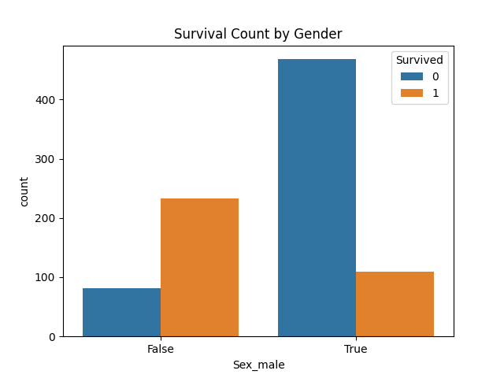
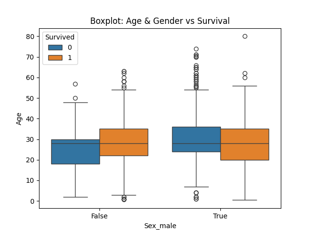

# Titanic-Death-Prediction
This project is a solution to the classic Kaggle Titanic Competition, where the goal is to predict which passengers survived the Titanic shipwreck using basic machine learning techniques.
# 🚢 Titanic - Machine Learning from Disaster

A beginner-friendly machine learning classification project based on the [Kaggle Titanic Competition](https://www.kaggle.com/competitions/titanic), where the task is to predict survival outcomes of passengers aboard the RMS Titanic using passenger data (such as age, gender, class, etc.).

---

## 🧠 Problem Statement

Build a predictive model to determine which passengers survived the Titanic shipwreck using available features. This problem introduces essential steps in an ML pipeline, including data cleaning, feature engineering, model training, evaluation, and submission.

---

## 📂 Dataset

- `train.csv`: Training dataset containing features and survival labels.
- `test.csv`: Test dataset for generating predictions.
- `gender_submission.csv`: Sample submission file provided by Kaggle.

---

## ✅ Final Results

- 📈 **Model Used**: Random Forest Classifier (with GridSearchCV tuning)
- 🎯 **Kaggle Accuracy**: 82.03%
- 🏅 **Leaderboard Rank**: 3123  
- 🔗 [View on Kaggle Leaderboard](https://www.kaggle.com/competitions/titanic/leaderboard)

---

## 🔧 Techniques Used

- Data Cleaning: Missing value imputation (Age, Fare, Embarked)
- Feature Engineering: One-hot encoding for categorical variables (Sex, Embarked)
- Model Training:
  - Logistic Regression
  - Decision Tree Classifier
  - Random Forest Classifier
- Model Tuning: GridSearchCV for hyperparameter optimization
- Evaluation: Accuracy score, precision, recall, F1-score

---

## Basic Concepts

1. Logistic Regression
-Type: Linear Classification Model

-Purpose: Estimates the probability of survival using a logistic (sigmoid) function.

-Test Accuracy: 81.0%

-Strengths: Simple, interpretable, fast to train.

2. Decision Tree Classifier
-Type: Tree-based Model

-Purpose: Splits data based on feature thresholds to make survival predictions.

-Test Accuracy: 78.2%

-Strengths: Handles non-linear data well, easy to visualize.

3. Random Forest Classifier
-Type: Ensemble of Decision Trees

-Purpose: Averages multiple decision trees to reduce overfitting and improve performance.

-Test Accuracy: 82.1%

-Strengths: Better generalization, handles both numerical and categorical data.

4. Random Forest (GridSearch Optimized)
-Type: Hyperparameter-Tuned Random Forest

-Purpose: Uses GridSearchCV to find the best combination of hyperparameters.

-Cross-Validation Accuracy: 83.5%

-Best Params: n_estimators=100, max_depth=5, min_samples_split=2

-Strengths: Improved performance and generalization by fine-tuning.

---

## 📊 Visualizations




Output -> 
```bash
Logistic Regression Accuracy: 0.8100558659217877
              precision    recall  f1-score   support

           0       0.83      0.86      0.84       105
           1       0.79      0.74      0.76        74

    accuracy                           0.81       179
   macro avg       0.81      0.80      0.80       179
weighted avg       0.81      0.81      0.81       179


Decision Tree Accuracy: 0.7821229050279329
              precision    recall  f1-score   support

           0       0.82      0.80      0.81       105
           1       0.73      0.76      0.74        74

    accuracy                           0.78       179
   macro avg       0.78      0.78      0.78       179
weighted avg       0.78      0.78      0.78       179


Random Forest Accuracy: 0.8212290502793296
              precision    recall  f1-score   support

           0       0.83      0.87      0.85       105
           1       0.80      0.76      0.78        74

    accuracy                           0.82       179
   macro avg       0.82      0.81      0.81       179
weighted avg       0.82      0.82      0.82       179


GridSearchCV Best Parameters: {'max_depth': 5, 'min_samples_split': 2, 'n_estimators': 100}
GridSearchCV Best CV Score: 0.8356446370530877

✅ Submission file created as 'submission.csv'
```
---

## 🧾 Files and Structure

├── train.csv

├── test.csv]

├── gender_submission.csv

├── submission.csv # Final prediction submission file

├── script.py # Core Python script for training and prediction

├── Model Accuracy Rate.py

├── plots

└── README.md


---

## 💡 Future Improvements

- Add feature scaling for models like SVM or KNN
- Try ensemble models like **XGBoost**, **GradientBoostingClassifier**
- Apply advanced feature engineering (e.g., extracting titles from names)
- Use cross-validation for more robust evaluation

---

## 📌 How to Run

```bash
pip install pandas numpy scikit-learn matplotlib seaborn
python script.py
python Model-Accuracy-Rate.py
```

Let me know if you want this in notebook-style or want to add a Jupyter version of this project too!
This is my attempt to make Mini project series for students to start learning Machine Learning Via Implementation
